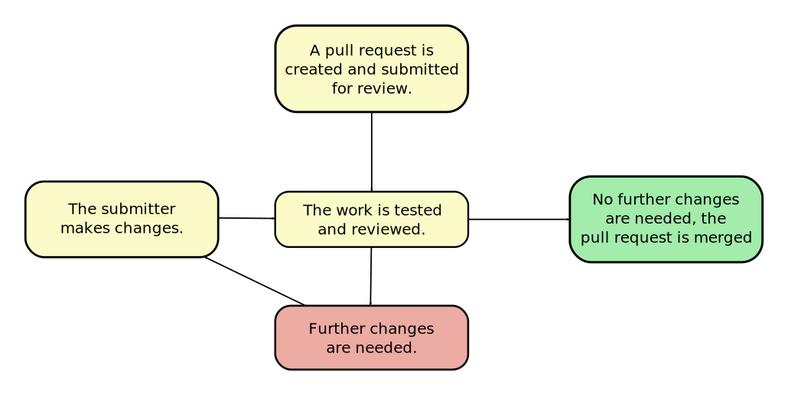

Title: CI Requirements and Candidate Evaluation.
Date: 2018-07-25 14:30
Category: QA
Tags: CI
Slug: ci-requirements-and-candidate-evaluation
Author: Tony Atkins <tony@raisingthefloor.org>
Summary: A comparison of our requirements for CI as a tool in managing changes to our repositories.

## Introduction

Continuous Integration (CI) is a key part of our development process both within the Fluid community and within the
GPII.  CI gives an objective and more or less immediate view of the health of our code, and of the quality of changes we
propose to make to our code.  It is an essential safety net to help distributed teams working on rapidly evolving
systems.

Within the Fluid community and GPII, we currently have a mixture of legacy Jenkins build configurations, BuildKite
builds (for Infusion) and experiments with tools like GitLab.  This page attempts to compare build requirements with the
features of various tools.

There are many uses for CI:

1. Builds that are run to evaluate proposed code changes.
2. Nightly builds that guard against problems with changes inherited from dependencies, such as a new version of the
   target platform.
3. Build pipelines that result in creating releases, deploying updated containers, et cetera.

For the purposes of this discussion I am focused on the first, the process of managing changes to our repositories.

## Requirements

Our codebases are hosted in an organisational repository that contains the "target" for changes, generally the "master"
branch of our codebase.  We tend to make changes to our code roughly as follows:

1. The need for a change (bug fix, new feature) is identified.
2. The change is written up and discussed, generally as a JIRA ticket.
3. Individuals wishing to make changes:
   1. Create a JIRA ticket describing their work or take ownership of an existing ticket.
   2. "Fork" the organisational repository.
   3. Create a branch in their repository for their work.
   4. Submit a pull request for their work against a branch in the organisational repository (typically against "master).
3. Once a pull has been submitted:
   1. If the request is from a core committer, builds are run automatically.
   2. Otherwise, someone with access must comment on the issue to trigger a build.
   3. Build results are displayed inline as part of the discussion thread on the PR.
   4. For builds that use our legacy Jenkins setup, a build can be retriggered by commenting.

CI is key for the third step in this process, which is illustrated in the following diagram.

In this context, CI builds provide a shared and consistent way to talk about test failures, coverage reports, log
output, and are often used many times within a single review.

Most of our core requirements are the same moving forward.  The one key improvement we have discussed is devolving as
much ownership as we can of build configurations to the community contributing changes to each project.  Although we
have experimented with tools that support decentralised build configurations, currently our build configurations are
managed centrally in a separate repository, and there is one build configuration per codebase.

For the future, we want to have much of the build configuration be part of the codebase, so that:

1. Changes can be tested in isolation without disrupting other ongoing work.
2. The developer submitting a change to the build can demonstrate in context that the changes work as expected.

As we will review a comparison chart of a range of solutions, let's break those down into requirements with a shorthand
term for each:

* __Remote Forks__: An acceptable solution should be able to monitor pull requests against an organisational repository
  but test against the contributor's repository and branch.
* __Results in Pull Request__: The results of a build should be summarised in the PR, with a link to more details.
* __Access Controls__: Many of our libraries are open source.  We want to allow nearly anyone to
  contribute, but do not want to allow just anyone to use our build resources.
* __Restart Builds__: If a build fails for reasons that seem unique to CI, we commonly restart the build to
  confirm.
* __In-branch Configuration__: The rules that govern the unique parts of a build (dependencies, test commands,
  artifacts, et cetera) should live within the repository, so that changes to the CI configuration can be managed by the
  community of contributors with only minimal support from operations.
* __Local Agents__: It should be possible to use our own build agents.

## Solution Comparison

| Stars                                     | Meaning                                                |
| ----------------------------------------- | ------------------------------------------------------ |
|  | Supports the use case easily (for example, with only configuration options). |
|      | Supports the use case less well (multiple clicks, plugins required, partial functionality). |
|       | May support the use case with custom development.         |
|        | Cannot support the use case.                           |

| Solution          | Remote Forks | Results in PR | Access Controls | Restart Builds | In-branch Config | Local Agents |
| ----------------- | ------------ | ------------- | --------------- | -------------- | ---------------- | ------------ |
| BuildKite         |  |  |  |  |  |   |
| GitLab            |  |  |  |  |  |  |
| Jenkins (legacy)  |  |  |  |  |  |  |
| Jenkins Pipelines |  |  |  |  |  |  |
| Travis CI         |  |   |   |   |  |  |

### BuildKite

BuildKite does not support the remote fork model we use by default.  BuildKite displays results in a PR, but only as
a webhook results summary.  It does not have the ability to comment.  It does not support the type of access controls
or comment-based restarting of jobs that we are accustomed to.  It only supports a single client by default. In
addition, build results require an account, and you cannot view logs without access.

Avtar has developed a custom service that we use with webhooks, which closes most of the gaps between the built-in
functionality and our use cases.

### GitLab

GitLab does not directly support the remote fork model we use.  By default, GitLab does not support the type of access
controls we are accustomed to, or retriggering of builds.  GitLab also does not support results as comments, there is
is currently a [feature request](https://gitlab.com/gitlab-org/gitlab-ce/issues/23902).

We would need to build an external service that closes the gaps.  There is a good API for building services
like this, but we would have to build a new service largely from scratch.

### Jenkins (legacy)

Our Jenkins legacy configuration obviously satisfies all of our use cases.  However, although we have traditionally used
Jenkins and the multi-job plugin, there are supportability concerns about that long term.  It was not owned or supported
for some time, and although development has resumed, there are still concerns about using that versus something built by
and supported by the Jenkins team.

### Jenkins Pipelines

Jenkins Pipelines offer key improvements over the legacy solution in that:

1. they provide their own robust declarative syntax
2. they have support for complex chaining of builds, including a try/catch/finally construct that ensures that a
   sequence of builds stops on the first failure, but that teardown steps are still allowed to execute.

Jenkins Pipelines support the remote fork model we use.  They offer the type of access controls we require, but
permission checks are only respected when retriggering builds from a comment.  The ability to hold off on an initial
build (or a rebuild when a new commit is made).

As with many other solutions, Jenkins Pipelines would require some custom development.  However, they have the concept
of a "trait", and you can add new "traits" to change the behaviour of existing features.   This suggests that the
development effort involved would be lower, especially since as far as we know we only need to close a single major gap.

### Travis CI

Travis CI does not support the types of custom build agents we require.  It also would require significantly more
development to close a range of gaps.

## Conclusion

Jenkins Pipelines plus limited custom development seems to be the best approach for us moving forward.
